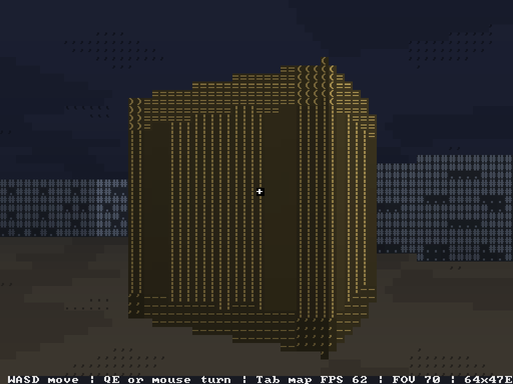
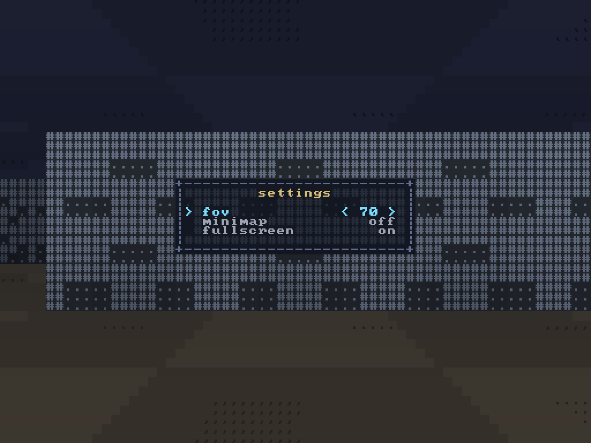
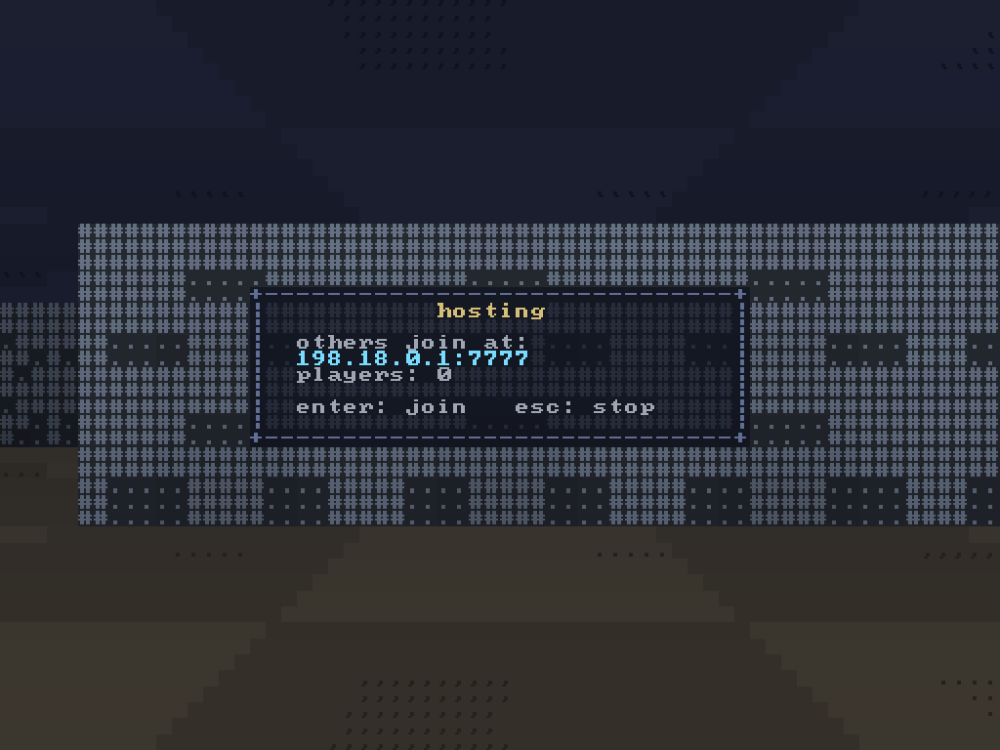

# ascii3d

**A first-person raycaster drawn entirely with text characters. It runs in a plain terminal or in an SDL2 window, and several players can walk the same map over the LAN.**

*Just a for-fun project. The code was written with the help of the GLM 5.3 AI model.*

<kbd>  </kbd>

<kbd>  </kbd>

<kbd>  </kbd>

 

## Features

- Wolfenstein-style grid raycasting ([Raycaster.cpp](src/render/Raycaster.cpp)): DDA walls with glyph textures, perspective-correct floor and ceiling casting, y-sheared pitch, head bob and distance fog.
- Two interchangeable backends behind one interface ([Display.h](include/platform/Display.h)): an ANSI terminal renderer with damage tracking and synchronized updates, and an SDL2 window that rasterizes an embedded 8x8 font. The backend is picked at runtime.
- Truecolor output when the terminal supports it, xterm-256 palette otherwise.
- LAN multiplayer through a relay server: each client reports its position every frame, the server broadcasts the world, and the other players appear as colored billboards occluded by walls ([Sprite.cpp](src/render/Sprite.cpp)).
- A start menu with offline, host and join ([StartMenu.cpp](src/ui/StartMenu.cpp)). Hosting spawns the server, then shows a dashboard with the LAN address and a live player count.
- In-game menu, settings page (FOV, minimap, fullscreen), minimap and HUD.
- Frame pacing at ~60 FPS, plus a diagnostics mode that samples timings and dumps percentiles on exit.

## Controls

| Input | Action |
| --- | --- |
| `W A S D` (or arrow keys) | move |
| mouse motion / `Q E` | look around |
| `Tab` | toggle minimap |
| `[` `]` | narrow / widen FOV |
| `F11` | fullscreen (window backend) |
| `Esc` | open menu / go back |
| arrows + `Enter` | navigate menus, confirm, type an address |
| `Ctrl+C` | quit (terminal backend) |

## Build

### Linux

A C++17 compiler and GNU Make are enough for the terminal build. SDL2 adds the window backend.

Debian / Ubuntu:

    sudo apt install build-essential libsdl2-dev

Fedora:

    sudo dnf install gcc-c++ make SDL2-devel

Arch:

    sudo pacman -S base-devel sdl2

Then, from the repository root:

    make            # builds build/ascii3d and build/ascii3d-server
    make run        # build, then run the game
    make clean      # remove build/

The Makefile auto-detects SDL2 through `sdl2-config` (`SDL=1` forces it with plain `-lSDL2` for toolchains without the helper script). For a terminal-only build that needs no SDL2 at all, for example over SSH or in a minimal container:

    make SDL=0

Clang works too: `make CXX=clang++`.

### Windows

> Not tested upstream. These routes follow from the code, not from a verified build.

The terminal backend has a native Win32 path (Windows 10+ console, VT sequences, mouse events in [Terminal.cpp](src/platform/Terminal.cpp)). The network stack, however, is still POSIX-only, so the toolchain must provide the POSIX headers:

- **WSL (easiest).** Install WSL2 with Ubuntu and follow the Linux instructions above. On Windows 11 the SDL window also works through WSLg; on Windows 10 you get the terminal build (`make SDL=0`).
- **MSYS2.** Install [MSYS2](https://www.msys2.org), open the **MSYS** shell (not UCRT64 or MINGW64) and install the toolchain:

      pacman -S gcc make
      make SDL=0
      ./build/ascii3d

  This builds against Cygwin's POSIX layer and the game runs inside the MSYS2 terminal. The server and multiplayer work there as well.
- **MinGW-w64 / MSVC (not yet).** A fully native build stops at [Socket.cpp](src/net/Socket.cpp) until it is ported to Winsock. That port is small and self-contained; the rest of the client already carries the Win32 console code.

### Other platforms

FreeBSD is supported deliberately (the `kern.proc.pathname` lookup and the vt console's 256-color fallback). macOS compiles through the POSIX paths but is untested.

## Run

Run from the repository root so the default map `assets/map.txt` is found:

    ./build/ascii3d [path/to/map.txt] [--connect host[:port]]

The backend is chosen at startup: the SDL window when a graphical session exists (`DISPLAY` or `WAYLAND_DISPLAY`), the terminal otherwise. A few environment variables tune the runtime:

| Variable | Values | Meaning |
| --- | --- | --- |
| `ASCII3D_BACKEND` | `terminal`, `sdl` | force a backend |
| `ASCII3D_COLOR` | `truecolor`, `256` | force the terminal color depth |
| `ASCII3D_DEBUG` | `1` | perf overlay, stats dump and input log |
| `ASCII3D_STATS` | path | stats dump location (default `/tmp/ascii3d-stats.txt`) |
| `ASCII3D_INPUT_LOG` | path | input log location (default `/tmp/ascii3d-input.txt`) |
| `ASCII3D_PORT` | number | default port for `ascii3d-server` |

## Multiplayer

The start menu offers three ways in:

- **start** — play offline.
- **host game** — spawn `ascii3d-server` as a child process, then show a dashboard with the LAN address and a live player count. `Enter` joins your own server, `Esc` tears it down.
- **join game** — type `host:port` (the port defaults to 7777) and press `Enter`.

The server ([src/server/main.cpp](src/server/main.cpp)) is a pure relay: it runs no simulation. It assigns session ids, applies the map's `@` spawn with a small per-session offset so players do not stack, and broadcasts the world snapshot every 30 ms. The wire format lives in [Protocol.h](include/net/Protocol.h).

For a dedicated machine, run the server by hand (or `make server`):

    ./build/ascii3d-server [path/to/map.txt] [--port=7777]

A client that loses the connection keeps playing offline.

## Map format

Maps are plain text, one character per tile. See the default [assets/map.txt](assets/map.txt):

| Character | Tile |
| --- | --- |
| `#` | stone wall |
| `%` | brick wall |
| `=` | mossy wall |
| `T` | pillar |
| `@` | spawn point |
| anything else | walkable floor |

Out-of-bounds tiles count as a solid border, so the world is always closed.

## Project layout

    accii/
    ├── assets/          map file and screenshots
    ├── include/         headers, one folder per module
    │   ├── core/        Vec2, Rgb
    │   ├── game/        Game, Map, Player, Diagnostics
    │   ├── net/         Socket, Protocol, NetClient
    │   ├── platform/    Display, Terminal, SdlDisplay, Input, Font8x8
    │   ├── render/      CharGrid, Raycaster, Sprite, Fog
    │   └── ui/          StartMenu, Menu, MenuPanel, SettingsPage, Hud, Minimap
    ├── src/             mirrors include/, plus main.cpp and server/main.cpp
    └── Makefile

Key files:

| File | Role |
| --- | --- |
| [src/game/Game.cpp](src/game/Game.cpp) | main loop, wires input, simulation, rendering and networking |
| [src/render/Raycaster.cpp](src/render/Raycaster.cpp) | DDA wall casting, floor and ceiling rows, fog |
| [src/platform/Terminal.cpp](src/platform/Terminal.cpp) | ANSI backend, raw-mode input, two-clock chord handling |
| [src/platform/SdlDisplay.cpp](src/platform/SdlDisplay.cpp) | SDL backend, 8x8 font rasterizer, pointer lock |
| [src/net/NetClient.cpp](src/net/NetClient.cpp) | non-blocking client, one poll per frame |
| [src/server/main.cpp](src/server/main.cpp) | the relay server |
| [Makefile](Makefile) | build, SDL autodetection, run and server targets |

